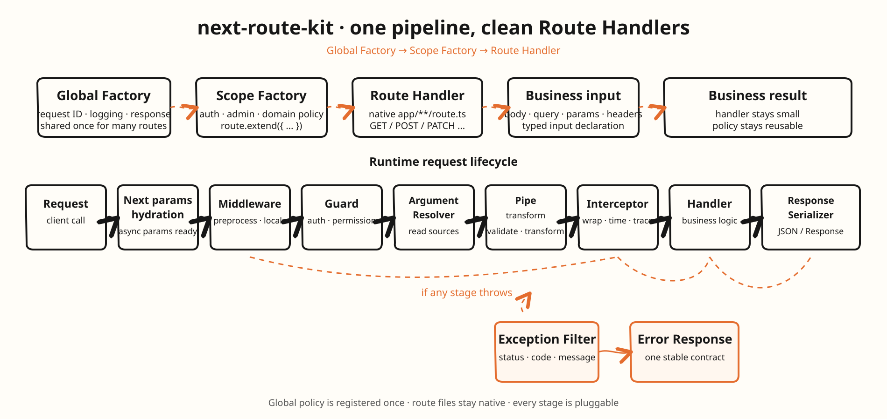

# next-route-kit

[](https://github.com/tech-zjf/next-route-kit/actions/workflows/ci.yml)

**English** · [简体中文](README.zh-CN.md)

Composable request infrastructure for Next.js App Router Route Handlers.

<p align="center">
  
</p>

## Why this package exists

Mature Next.js API projects repeat the same code in every `route.ts`:

- request ID and logging;
- authentication and authorization;
- JSON parsing and validation;
- response envelopes;
- application-error to HTTP conversion.

That repetition is not business value. It makes endpoints drift apart and can
consume a one-shot body before authentication by accident.

`next-route-kit` centralizes those policies in an immutable Factory scope while
keeping each Route Handler recognizable as a normal Next.js function. It is for
repeated cross-cutting policy across JSON APIs; it does not replace Next routing,
services, streaming, uploads, or domain logic.

## Stable API responses

If your API needs one `{ code, msg, data }` contract, register the optional plugin
once and let Services throw a typed business exception:

```ts
import { ApiException, apiResponsePlugin, createRoute } from 'next-route-kit'

const ResponseCode = {
    SUCCESS: { code: 'OK', msg: 'Success' },
    QUOTA_EXCEEDED: { code: 'QUOTA_EXCEEDED', msg: 'Quota exceeded', status: 409 },
    INVALID_INPUT: { code: 'INVALID_INPUT', msg: 'Invalid input', status: 422 },
    INTERNAL_ERROR: { code: 'INTERNAL_ERROR', msg: 'Internal server error' },
} as const

const apiRoute = createRoute({
    plugins: [apiResponsePlugin({ success: ResponseCode.SUCCESS, systemError: ResponseCode.INTERNAL_ERROR })],
})

export const POST = apiRoute({
    handler: async () => {
        if (/* application rule */ false) {
            throw new ApiException(ResponseCode.QUOTA_EXCEEDED)
        }

        return { resourceId: 'resource-demo' }
    },
})
```

The response is always `{ code: 'OK', msg: 'Success', data: { resourceId: 'resource-demo' } }`;
business errors use an application-owned response code and keep `data` as an object.
This gives a frontend one stable discriminator for global auth/quota handling and
feature-specific dialogs. See the [API response guide](docs/en/user-guide/api-response.md)
for migration patterns and list/error examples.

Unknown errors use the configured system response and are reported with
`console.error` by default. Configure `onUnknownError` to replace that reporter
with the application's logging, tracing, or error-monitoring integration.

## Install

```bash
npm install next-route-kit
npm install @next-route-kit/zod zod       # optional validation
npm install -D @next-route-kit/testing    # optional test helpers
```

## Quick start

Put shared policy in an ordinary server module. Nothing is registered in
`next.config.ts` and the package does not scan the filesystem.

```ts
// src/server/routes.ts
import { apiResponsePlugin, createRoute, unauthorized, type AnyRouteContext, type Guard, type RouteMiddleware } from 'next-route-kit'

// Application-owned response codes stay in the application, not in the package.
const ResponseCode = {
    SUCCESS: { code: 'OK', msg: 'Success' },
    INTERNAL_ERROR: { code: 'INTERNAL_ERROR', msg: 'Internal server error' },
} as const

// The request-local shape is explicit and is shared by this Factory scope.
type ApiLocals = {
    requestId: string
    startedAt: number
    userId?: string
}

type ApiContext = AnyRouteContext<ApiLocals>

// Middleware adds values that should be available to the rest of this request.
const requestContext: RouteMiddleware<ApiContext> = {
    name: 'request-context',
    use(context, next) {
        context.locals.requestId = context.request.headers.get('x-request-id') ?? crypto.randomUUID()
        context.locals.startedAt = Date.now()
        return next()
    },
}

// Guards run before body resolution and can populate authenticated locals.
const requireUser: Guard<ApiContext> = {
    name: 'authentication',
    canActivate(context) {
        if (context.request.headers.get('authorization') !== 'Bearer sample-token') {
            throw unauthorized()
        }

        context.locals.userId = 'viewer-demo'
        return true
    },
}

// Register cross-cutting policy once on the base Factory.
export const apiRoute = createRoute<ApiLocals>({
    middleware: [requestContext],
    plugins: [apiResponsePlugin({ success: ResponseCode.SUCCESS, systemError: ResponseCode.INTERNAL_ERROR })],
})

// Derived scopes inherit the base policy without mutating it.
export const authenticatedRoute = apiRoute.extend({
    guards: [requireUser],
})
```

`extend()` returns a new immutable scope. Global middleware, guards,
interceptors and filters are inherited; routes do not repeat them.

## Route Handlers stay native

The first handler argument is the native Web `Request`. The second argument only
contains the extra route context. There is no required `args` object and no
ambiguous `state` property.

### Detail: `GET /resources/:id`

```ts
import { authenticatedRoute } from '@/src/server/routes'

type ResourceParams = { id: string }

export const GET = authenticatedRoute<ResourceParams>({
    handler: async (request, { params, locals }) => {
        const resource = await resourceService.find(params.id, locals.userId)
        return resource ?? new Response(null, { status: 404 })
    },
})
```

### List: use native URL parsing when it is clearer

```ts
export const GET = authenticatedRoute({
    handler: async (request, { locals }) => {
        const url = new URL(request.url)
        return resourceService.list({
            userId: locals.userId,
            search: url.searchParams.get('search') ?? undefined,
            page: Number(url.searchParams.get('page') ?? 1),
        })
    },
})
```

### Create: declare body/query only when automatic resolution helps

```ts
import { jsonBody, query } from 'next-route-kit'

type CreateResourceInput = { title: string; content: string }
type CreateResourceQuery = { publish?: string }

export const POST = authenticatedRoute({
    body: jsonBody<CreateResourceInput>(),
    query: query<CreateResourceQuery>(),
    handler: async (request, { body, query: values, locals }) =>
        resourceService.create({
            userId: locals.userId,
            ...body,
            publish: values.publish === 'true',
            userAgent: request.headers.get('user-agent'),
        }),
})
```

### Update and delete

```ts
type ResourceParams = { id: string }
type UpdateResourceInput = { title?: string; content?: string }

export const PATCH = authenticatedRoute<ResourceParams, UpdateResourceInput>({
    body: jsonBody<UpdateResourceInput>(),
    handler: (_request, { params, body, locals }) => resourceService.update(params.id, locals.userId, body),
})

export const DELETE = authenticatedRoute<ResourceParams>({
    handler: async (_request, { params, locals }) => {
        await resourceService.remove(params.id, locals.userId)
        return new Response(null, { status: 204 })
    },
})
```

## Lifecycle

```text
Next params hydration
  → Middleware.use()
  → Guard.canActivate()
  → Interceptor.intercept() enter
  → declared body/query resolution
  → Pipe.transform()
  → handler(request, context)
  → Interceptor exit
  → Response serialization

ExceptionFilter.catch() handles errors from the whole chain.
```

Guards run before declared body resolution, so an unauthorized request does not
need to parse a malformed body. The order keeps the familiar separation between
request preparation, authorization, input handling, business logic, and response
serialization without introducing controllers, decorators, modules, dependency
injection, or a replacement router.

## Configuration

| Option             | Responsibility                                                         |
| ------------------ | ---------------------------------------------------------------------- |
| `middleware`       | request ID, logging, CORS, and request-local values; call `next()`     |
| `guards`           | authentication and authorization; return `false`, `Response`, or throw |
| `pipes`            | validate/transform each declared body or query argument                |
| `interceptors`     | response envelope, timing, cache, and tracing                          |
| `exceptionFilters` | convert known errors to a stable `Response`                            |
| `plugins`          | package reusable contributions to the same stages                      |
| `response`         | serialize plain values; native `Response` passes through               |
| `runtime`          | declare `nodejs` or `edge` for plugin diagnostics                      |

A route adds only optional `body`, optional `query`, and `handler`. Params
are already in `context.params`. Headers and the URL stay on `request`.
Use `defineInputSource()` only for a resolver that is genuinely reused.

## Custom plugins

Plugins are the extension point for reusable cross-cutting policy. A custom
plugin has three responsibilities:

1. give itself a stable `name` for diagnostics;
2. declare `runtime` when it only supports `nodejs`, `edge`, or `both`;
3. return lifecycle contributions from `install()`.

The public contract is:

```ts
import type { ExceptionFilter, Guard, Interceptor, Pipe, ResponseSerializer, RouteMiddleware } from 'next-route-kit'

type RoutePlugin = {
    readonly name: string
    readonly runtime?: 'nodejs' | 'edge' | 'both'
    install(): {
        middleware?: readonly RouteMiddleware[]
        guards?: readonly Guard[]
        pipes?: readonly Pipe[]
        interceptors?: readonly Interceptor[]
        exceptionFilters?: readonly ExceptionFilter[]
        responseSerializer?: ResponseSerializer
    }
}
```

The following is a complete, copy-ready plugin. It measures every request that
passes through its Factory scope and logs both successful and failed requests:

```ts
import { createRoute, type RoutePlugin } from 'next-route-kit'

class RequestTimingPlugin implements RoutePlugin {
    readonly name = 'request-timing'
    readonly runtime = 'both' as const

    install() {
        return {
            interceptors: [
                {
                    name: 'request-timing',
                    async intercept(context, next) {
                        const startedAt = Date.now()

                        try {
                            return await next()
                        } finally {
                            console.info('[request]', {
                                method: context.meta.method,
                                pathname: context.meta.pathname,
                                durationMs: Date.now() - startedAt,
                            })
                        }
                    },
                },
            ],
        }
    }
}

const apiRoute = createRoute({
    plugins: [new RequestTimingPlugin()],
})

export const GET = apiRoute({
    handler: (request) => ({ method: request.method }),
})
```

`install()` runs when the Factory or Route is compiled. Its returned
contributions are copied into an immutable snapshot; it is not called again for
each request. A plugin can receive application services through its constructor:

```ts
class AuditPlugin implements RoutePlugin {
    readonly name = 'audit'
    readonly runtime = 'nodejs' as const

    constructor(private readonly audit: AuditService) {}

    install() {
        return {
            middleware: [createAuditMiddleware(this.audit)],
        }
    }
}

const apiRoute = createRoute({
    plugins: [new AuditPlugin(auditService)],
})
```

Do not store request-specific state on the plugin instance. Put it in
`context.locals`; the same plugin instance can be used by many requests.

### What can be injected

| Contribution         | Typical responsibility                            | What it removes from Route files          |
| -------------------- | ------------------------------------------------- | ----------------------------------------- |
| `middleware`         | request ID, logging, CORS, request-local setup    | repeated outer request boilerplate        |
| `guards`             | authentication, authorization, API key checks     | repeated admission checks                 |
| `pipes`              | validation and input transformation               | repeated body/query validation            |
| `interceptors`       | timing, tracing, caching, response transformation | repeated before/after wrappers            |
| `exceptionFilters`   | known exception to safe `Response` conversion     | repeated `try/catch` and error switches   |
| `responseSerializer` | default plain-value serialization                 | repeated `NextResponse.json` construction |

Use `apiResponsePlugin()` when the goal is the standard `{ code, msg, data }`
contract. Write a custom plugin when the policy is application-specific or
needs to bundle several contributions together.

### Where to inject a plugin

```ts
// 1. Base Factory: inherited by every Route created from this scope.
const apiRoute = createRoute({
    plugins: [new RequestTimingPlugin(), new AuditPlugin(auditService)],
})

// 2. Derived scope: inherited only by this boundary and its children.
const authenticatedRoute = apiRoute.extend({
    plugins: [new PermissionPlugin(permissionService)],
    guards: [requireUser],
})

// 3. One Route: use `use` or the longer `plugins` spelling.
export const GET = authenticatedRoute({
    use: [new CachePlugin(cache)],
    handler: handler,
})
```

Scope composition is immutable:

```text
base Factory → derived Factory → Route-local configuration
```

Middleware, Guards, Pipes, and Interceptors append in that order. Within one
scope, directly declared arrays run before that scope's plugin contributions.
ExceptionFilters are tried from the most local scope outward. A more local
`response`/`responseSerializer` overrides an inherited serializer. A duplicate
plugin serializer in the same configuration layer is rejected.

### Complete request chain

```text
Factory compilation (once)
  → install plugins
  → aggregate contributions in registration order
  → validate declared Node/Edge runtime
  → freeze the immutable scope
  → compile the native Next Handler

Each request
  → Next params hydration
  → Middleware enter (registration order)
  → Guard (registration order)
  → Interceptor enter (registration order)
  → declared body/query resolvers
  → Pipe (field order, then registration order)
  → Handler(request, { params, locals, meta, body?, query? })
  → Interceptor exit (reverse order)
  → Middleware exit (reverse order)
  → ResponseSerializer
```

The execution rules are deliberate:

- Guards run before body/query resolution, so an unauthorized request can stop
  before an invalid or expensive body is read.
- Body and Query are optional. If both are declared, their resolver work may
  start concurrently; application code must not depend on one resolving first.
- Each declared input field passes through every global and local Pipe in order.
- Middleware and Interceptors are nested: code before `next()` runs forward and
  code after `await next()` runs backward.
- A Guard can return `false`, throw, or return a `Response`. A returned Response
  short-circuits Interceptors and the Handler but still passes through the outer
  Middleware/Response boundary.
- Errors from params hydration, Middleware, Guards, resolvers, Pipes,
  Interceptors, or the Handler go to ExceptionFilters. The first Filter that
  returns a Response wins.
- A native `Response` returned by a Handler bypasses the default serializer and
  keeps its status, headers, and body.

See the [detailed plugin guide](docs/en/user-guide/plugins.md) for every
contribution contract and the [API reference](docs/en/user-guide/api-reference.md)
for the complete public type surface.

## Validation

Validation is also opt-in. The main package has no Zod dependency and never
registers a validator or filter for you. Use `@next-route-kit/zod` only when the
application chooses Zod. If the route uses the `{ code, msg, data }` envelope,
map the optional adapter error through `apiResponsePlugin` and do not register
the standalone `zodExceptionFilter` on the same route:

```ts
import { z } from 'zod'
import { apiResponsePlugin, createRoute, jsonBody } from 'next-route-kit'
import { ZodValidationError, zodPipe } from '@next-route-kit/zod'

const schema = z.object({ title: z.string().min(1) })
const ResponseCode = {
    SUCCESS: { code: 'OK', msg: 'Success' },
    INVALID_INPUT: { code: 'INVALID_INPUT', msg: 'Invalid input', status: 422 },
    INTERNAL_ERROR: { code: 'INTERNAL_ERROR', msg: 'Internal server error' },
} as const

const route = createRoute({
    pipes: [zodPipe(schema, { appliesTo: 'body' })],
    plugins: [
        apiResponsePlugin({
            success: ResponseCode.SUCCESS,
            systemError: ResponseCode.INTERNAL_ERROR,
            mapError: (error) => {
                if (!(error instanceof ZodValidationError)) {
                    return undefined
                }

                return {
                    code: ResponseCode.INVALID_INPUT,
                    data: { issues: error.issues },
                }
            },
        }),
    ],
})

export const POST = route({
    body: jsonBody<z.input<typeof schema>>(),
    handler: (_request, { body }) => ({ title: body.title }),
})
```

Without the API envelope, the standalone `zodExceptionFilter()` is an optional
alternative and returns its own adapter-specific JSON shape. Choose one error
boundary for a route so two filters do not produce competing response contracts.

## Keep these routes native

Streaming, multipart upload, signed webhook, cron, redirect, and complex
multi-stage job routes can keep using the native Next.js Handler. The package is
for repeated JSON CRUD and authentication policy, not for wrapping every route.

## Packages and docs

- [`next-route-kit`](packages/next-route-kit/README.md)
- [`@next-route-kit/core`](packages/core/README.md)
- [`@next-route-kit/zod`](packages/zod/README.md)
- [`@next-route-kit/testing`](packages/testing/README.md)
- [English user guide](docs/en/README.md) · [中文用户指南](docs/zh-CN/README.md)
- [Compatibility matrix](docs/compatibility/next-matrix.md)

## Compatibility

Next.js App Router Route Handlers, Node.js `>=18.18.0`, and Node/Edge targets
when the composed plugins support the selected runtime. This repository verifies
Next.js 15 and 16 fixtures.

## License

MIT.
