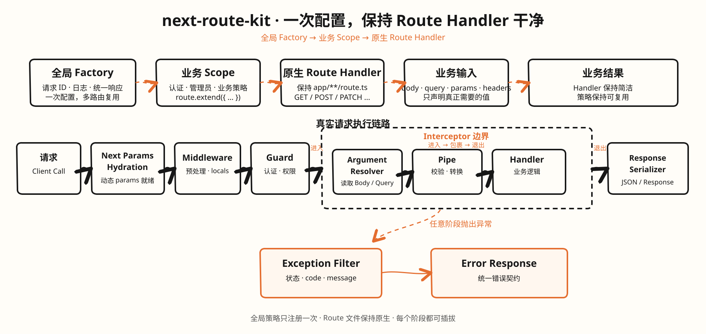

# next-route-kit

[](https://github.com/tech-zjf/next-route-kit/actions/workflows/ci.yml)

[English](README.md) · **简体中文**

面向 Next.js App Router Route Handler 的可组合请求基础设施。

<p align="center">
  
</p>

## 它解决什么问题

成熟的 Next.js API 项目经常在每个 `route.ts` 重复：

- Request ID 和日志；
- 鉴权与权限判断；
- JSON Body 解析和校验；
- 统一成功响应；
- 业务异常到 HTTP 响应的转换。

这些代码不是业务价值，却会让接口行为逐渐分叉，还可能因为顺序错误，在鉴权
之前消费只能读取一次的 Body。

`next-route-kit` 把这些策略放进不可变 Factory 作用域，同时保留原生 Next.js
Handler 的形状。它适合大量 JSON API 的横切逻辑重复，不替换 Next.js 路由，也
不接管流式响应、文件上传或业务 Service。

## 统一 API 响应

如果项目需要统一的 `{ code, msg, data }` 契约，可以只注册一次可选插件，业务层
直接抛出类型化的业务异常：

```ts
import { ApiException, apiResponsePlugin, createRoute } from 'next-route-kit'

const ResponseCode = {
    SUCCESS: { code: 'OK', msg: '成功' },
    QUOTA_EXCEEDED: { code: 'QUOTA_EXCEEDED', msg: '配额不足', status: 409 },
    INTERNAL_ERROR: { code: 'INTERNAL_ERROR', msg: '系统错误' },
} as const

const apiRoute = createRoute({
    plugins: [apiResponsePlugin({ success: ResponseCode.SUCCESS, systemError: ResponseCode.INTERNAL_ERROR })],
})

export const POST = apiRoute({
    handler: async () => {
        if (/* 业务规则 */ false) {
            throw new ApiException(ResponseCode.QUOTA_EXCEEDED)
        }

        return { resourceId: 'resource-demo' }
    },
})
```

成功响应始终是 `{ code: 'OK', msg: '成功', data: { resourceId: 'resource-demo' } }`；
业务异常使用应用自己维护的响应码，`data` 仍然保持对象。前端因此可以用一份稳定契约
统一处理登录、权限、配额等全局错误，再由具体页面处理自己的业务弹窗。详见
[统一 API 响应指南](docs/zh-CN/user-guide/api-response.md)，其中包含通用的迁移和列表、
异常示例。

## 安装

```bash
npm install next-route-kit
npm install @next-route-kit/zod zod       # 可选：Zod 校验
npm install -D @next-route-kit/testing    # 可选：测试辅助
```

## 快速开始

在普通服务端模块中创建共享策略。不需要修改 `next.config.ts`，包也不会扫描
文件系统。

```ts
// src/server/routes.ts
import { apiResponsePlugin, createRoute, unauthorized, type AnyRouteContext, type Guard, type RouteMiddleware } from 'next-route-kit'

// 响应码由业务项目维护，包只负责统一传输结构。
const ResponseCode = {
    SUCCESS: { code: 'OK', msg: '成功' },
    INTERNAL_ERROR: { code: 'INTERNAL_ERROR', msg: '系统错误' },
} as const

// 请求级共享数据的类型在这里集中声明。
type ApiLocals = {
    requestId: string
    startedAt: number
    userId?: string
}

type ApiContext = AnyRouteContext<ApiLocals>

// Middleware 为当前请求准备 requestId 等共享值。
const requestContext: RouteMiddleware<ApiContext> = {
    name: 'request-context',
    use(context, next) {
        context.locals.requestId = context.request.headers.get('x-request-id') ?? crypto.randomUUID()
        context.locals.startedAt = Date.now()
        return next()
    },
}

// Guard 在解析 Body 前执行，并把认证结果写入 locals。
const requireUser: Guard<ApiContext> = {
    name: 'authentication',
    canActivate(context) {
        if (context.request.headers.get('authorization') !== 'Bearer sample-token') {
            throw unauthorized()
        }

        context.locals.userId = 'viewer-demo'
        return true
    },
}

// 在基础 Factory 上注册一次横切策略。
export const apiRoute = createRoute<ApiLocals>({
    middleware: [requestContext],
    plugins: [apiResponsePlugin({ success: ResponseCode.SUCCESS, systemError: ResponseCode.INTERNAL_ERROR })],
})

// 派生作用域继承基础策略，且不会修改父 Factory。
export const authenticatedRoute = apiRoute.extend({
    guards: [requireUser],
})
```

`extend()` 会生成新的不可变作用域，不会修改父 Factory，也不需要每个接口重复
全局 Middleware、Guard、Pipe、Interceptor 或 Exception Filter。

## Route Handler 保持原生

Handler 的第一个参数就是原生 Web `Request`，第二个参数只包含 Factory
提供的额外上下文。没有强制的 `args` 对象，也没有含义模糊的 `state`；
请求级共享数据使用 `locals`。

### 详情：`GET /articles/:id`

```ts
import { authenticatedRoute } from '@/src/server/routes'

type ArticleParams = { id: string }

export const GET = authenticatedRoute<ArticleParams>({
    handler: async (request, { params, locals }) => {
        const article = await articleService.find(params.id, locals.userId)
        return article ?? new Response(null, { status: 404 })
    },
})
```

### 列表：直接使用原生 URL

```ts
export const GET = authenticatedRoute({
    handler: async (request, { locals }) => {
        const url = new URL(request.url)
        return articleService.list({
            userId: locals.userId,
            search: url.searchParams.get('search') ?? undefined,
            page: Number(url.searchParams.get('page') ?? 1),
        })
    },
})
```

### 创建：只有需要自动解析时才声明 Body/Query

```ts
import { jsonBody, query } from 'next-route-kit'

type CreateArticleInput = { title: string; content: string }
type CreateArticleQuery = { publish?: string }

export const POST = authenticatedRoute({
    body: jsonBody<CreateArticleInput>(),
    query: query<CreateArticleQuery>(),
    handler: async (_request, { body, query: values, locals }) =>
        articleService.create({
            userId: locals.userId,
            ...body,
            publish: values.publish === 'true',
        }),
})
```

### 更新和删除

```ts
type ArticleParams = { id: string }
type UpdateArticleInput = { title?: string; content?: string }

export const PATCH = authenticatedRoute<ArticleParams, UpdateArticleInput>({
    body: jsonBody<UpdateArticleInput>(),
    handler: (_request, { params, body, locals }) => articleService.update(params.id, locals.userId, body),
})

export const DELETE = authenticatedRoute<ArticleParams>({
    handler: async (_request, { params, locals }) => {
        await articleService.remove(params.id, locals.userId)
        return new Response(null, { status: 204 })
    },
})
```

## 请求生命周期

```text
Next params hydration
  → Middleware.use()
  → Guard.canActivate()
  → Interceptor.intercept() enter
  → 声明的 Body/Query 解析
  → Pipe.transform()
  → handler(request, context)
  → Interceptor 退出
  → Response 序列化

异常由 ExceptionFilter.catch() 处理。
```

Guard 在声明的 Body 解析之前执行，因此未登录请求不会先解析非法 JSON。这个顺序
生命周期按常见的服务端请求链路组织，但没有引入 Controller、Decorator、Module、
依赖注入容器或替换路由器。

## 配置选项

| 选项               | 作用                                                            |
| ------------------ | --------------------------------------------------------------- |
| `middleware`       | Request ID、日志、CORS、请求级共享值；继续执行需要调用 `next()` |
| `guards`           | 鉴权、权限、API Key；可以返回 `false`、`Response` 或抛异常      |
| `pipes`            | 校验或转换声明的 Body/Query 参数                                |
| `interceptors`     | 统一响应、耗时、缓存、链路追踪                                  |
| `exceptionFilters` | 把已知异常转换成稳定 `Response`                                 |
| `plugins`          | 把可复用组件打包成插件                                          |
| `response`         | 序列化普通返回值，原生 `Response` 直接透传                      |
| `runtime`          | 声明 `nodejs` 或 `edge`，提前诊断插件兼容性                     |

Route 只额外增加可选的 `body`、可选的 `query` 和 `handler`。Params 已在
`context.params` 中；Header 和 URL 留在 `request` 上。只有重复使用确实有价值
时，才写 `defineInputSource()`。

## 自定义插件

插件是可复用横切策略的扩展点。一个自定义插件需要完成三件事：

1. 使用稳定的 `name`，便于诊断和排查；
2. 如果只支持某个运行时，声明 `runtime` 为 `nodejs`、`edge` 或 `both`；
3. 在 `install()` 中返回要注入的生命周期组件。

公开契约如下：

```ts
import type { ExceptionFilter, Guard, Interceptor, Pipe, ResponseSerializer, RouteMiddleware } from 'next-route-kit'

type RoutePlugin = {
    readonly name: string
    readonly runtime?: 'nodejs' | 'edge' | 'both'
    install(): {
        middleware?: readonly RouteMiddleware[]
        guards?: readonly Guard[]
        pipes?: readonly Pipe[]
        interceptors?: readonly Interceptor[]
        exceptionFilters?: readonly ExceptionFilter[]
        responseSerializer?: ResponseSerializer
    }
}
```

下面是一个可以直接复制改造的完整插件。它会统计该 Factory 作用域内每个请求的耗时，
无论成功还是异常都会记录：

```ts
import { createRoute, type RoutePlugin } from 'next-route-kit'

class RequestTimingPlugin implements RoutePlugin {
    readonly name = 'request-timing'
    readonly runtime = 'both' as const

    install() {
        return {
            interceptors: [
                {
                    name: 'request-timing',
                    async intercept(context, next) {
                        const startedAt = Date.now()

                        try {
                            return await next()
                        } finally {
                            console.info('[request]', {
                                method: context.meta.method,
                                pathname: context.meta.pathname,
                                durationMs: Date.now() - startedAt,
                            })
                        }
                    },
                },
            ],
        }
    }
}

const apiRoute = createRoute({
    plugins: [new RequestTimingPlugin()],
})

export const GET = apiRoute({
    handler: (request) => ({ method: request.method }),
})
```

`install()` 在 Factory 或 Route 编译配置时执行。返回的贡献项会被复制到不可变快照中，
不会每个请求重复执行。插件依赖的业务服务可以通过构造函数注入：

```ts
class AuditPlugin implements RoutePlugin {
    readonly name = 'audit'
    readonly runtime = 'nodejs' as const

    constructor(private readonly audit: AuditService) {}

    install() {
        return {
            middleware: [createAuditMiddleware(this.audit)],
        }
    }
}

const apiRoute = createRoute({
    plugins: [new AuditPlugin(auditService)],
})
```

不要把请求级状态放在插件实例属性上，应放在 `context.locals`。同一个插件实例可能会被
多个请求共同使用。

### 可以注入什么

| 贡献项               | 典型职责                           | 从 Route 中消除的重复代码     |
| -------------------- | ---------------------------------- | ----------------------------- |
| `middleware`         | Request ID、日志、CORS、请求初始化 | 外层请求模板                  |
| `guards`             | 鉴权、权限、API Key 检查           | 重复的请求准入判断            |
| `pipes`              | 参数校验和输入转换                 | 重复的 Body/Query 校验        |
| `interceptors`       | 耗时、追踪、缓存、响应转换         | 重复的前后置包装              |
| `exceptionFilters`   | 已知异常转换成安全 `Response`      | 重复的 `try/catch` 和错误分支 |
| `responseSerializer` | 普通返回值的默认序列化             | 重复构造 `NextResponse.json`  |

如果目标是统一 `{ code, msg, data }` 契约，直接使用 `apiResponsePlugin()`；如果是业务项目
自己的策略，或需要把多个生命周期组件打包在一起，就创建自定义插件。

### 在哪里注入

```ts
// 1. 基础 Factory：该作用域创建的所有 Route 都会继承。
const apiRoute = createRoute({
    plugins: [new RequestTimingPlugin(), new AuditPlugin(auditService)],
})

// 2. 派生作用域：只对这个边界及其子 Route 生效。
const authenticatedRoute = apiRoute.extend({
    plugins: [new PermissionPlugin(permissionService)],
    guards: [requireUser],
})

// 3. 单个 Route：使用 `use`，也可以写完整的 `plugins`。
export const GET = authenticatedRoute({
    use: [new CachePlugin(cache)],
    handler,
})
```

作用域组合是不可变的：

```text
基础 Factory → 派生 Factory → Route 局部配置
```

Middleware、Guard、Pipe、Interceptor 按这个方向追加。同一个作用域内，直接声明的数组
先执行，再执行该作用域插件的贡献项。ExceptionFilter 按最局部作用域到继承作用域的顺序
尝试；更局部的 `response`/`responseSerializer` 会覆盖继承的 serializer；同一配置层重复的
插件 serializer 会抛错。

### 完整请求链路

```text
Factory 编译阶段（只执行一次）
  → 安装插件
  → 按注册顺序聚合贡献项
  → 校验声明的 Node/Edge 运行时
  → 冻结不可变作用域
  → 编译原生 Next Handler

每个请求
  → Next params hydration
  → Middleware 进入（注册顺序）
  → Guard（注册顺序）
  → Interceptor 进入（注册顺序）
  → 声明的 Body/Query Resolver
  → Pipe（先按字段，再按注册顺序）
  → Handler(request, { params, locals, meta, body?, query? })
  → Interceptor 退出（逆序）
  → Middleware 退出（逆序）
  → ResponseSerializer
```

执行规则是有意这样设计的：

- Guard 在 Body/Query 解析前执行，未登录请求可以在读取非法或昂贵 Body 前直接结束；
- Body 和 Query 都是可选的；两者同时声明时，Resolver 可能并发开始，业务代码不能依赖谁先完成；
- 每个声明的输入字段都会依次通过所有全局和局部 Pipe；
- Middleware 和 Interceptor 是嵌套调用：`next()` 前的代码正向执行，`await next()` 后的代码逆向执行；
- Guard 可以返回 `false`、抛异常或返回 `Response`。返回 Response 会短路 Interceptor 和 Handler，
  但仍会经过外层 Middleware/Response 边界；
- Params hydration、Middleware、Guard、Resolver、Pipe、Interceptor 或 Handler 抛出的异常都会进入
  ExceptionFilter，第一个返回 Response 的 Filter 获胜；
- Handler 返回原生 `Response` 时绕过默认 serializer，并保留原有 status、headers 和 body。

完整贡献契约见[插件详细指南](docs/zh-CN/user-guide/plugins.md)，全部公开类型见
[API Reference](docs/zh-CN/user-guide/api-reference.md)。

## Zod 校验

```ts
import { z } from 'zod'
import { createRoute, jsonBody } from 'next-route-kit'
import { zodExceptionFilter, zodPipe } from '@next-route-kit/zod'

const schema = z.object({ title: z.string().min(1) })
const route = createRoute({
    pipes: [zodPipe(schema, { appliesTo: 'body' })],
    exceptionFilters: [zodExceptionFilter({ status: 422 })],
})

export const POST = route({
    body: jsonBody<z.input<typeof schema>>(),
    handler: (_request, { body }) => ({ title: body.title }),
})
```

## 这些 Route 保持原生

流式响应、Multipart 上传、签名 Webhook、Cron、重定向和复杂多阶段任务可以继续
使用原生 Next.js Handler。这个包服务于重复的 JSON CRUD 和鉴权策略，不会强行给
所有 Route 套一层抽象。

## 包与文档

- [`next-route-kit`](packages/next-route-kit/README.md)
- [`@next-route-kit/core`](packages/core/README.md)
- [`@next-route-kit/zod`](packages/zod/README.md)
- [`@next-route-kit/testing`](packages/testing/README.md)
- [中文用户指南](docs/zh-CN/README.md) · [English user guide](docs/en/README.md)
- [Next.js 兼容矩阵](docs/compatibility/next-matrix.md)

## 兼容范围

Next.js App Router Route Handler、Node.js `>=18.18.0`，以及所有插件支持目标运行时
时的 Node/Edge。仓库会用 Next.js 15/16 fixture 验证。

## License

MIT。
